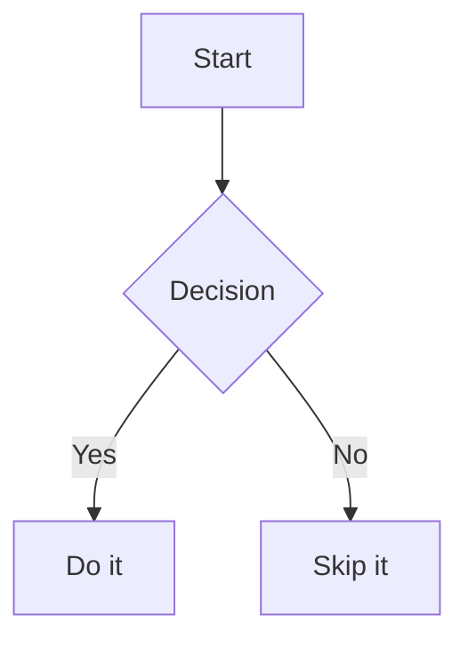

# 📄 docskin

[](https://github.com/cdeimling/docskin/actions)
[](https://pypi.python.org/pypi/ruff)
[](https://github.com/PyCQA/bandit)
[](https://github.com/astral-sh/ruff)
[](https://pypi.org/project/docskin/)
<!-- Pytest Coverage Comment:Begin -->
<a href="https://github.com/cdeimling/docskin/blob/main/README.md"></a><details><summary>Coverage Report </summary><table><tr><th>File</th><th>Stmts</th><th>Miss</th><th>Branch</th><th>BrPart</th><th>Cover</th><th>Missing</th></tr><tbody><tr><td colspan="7"><b>docskin</b></td></tr><tr><td>&nbsp; &nbsp;<a href="https://github.com/cdeimling/docskin/blob/main/docskin/__init__.py">\_\_init\_\_.py</a></td><td>0</td><td>0</td><td>0</td><td>0</td><td>100%</td><td>&nbsp;</td></tr><tr><td>&nbsp; &nbsp;<a href="https://github.com/cdeimling/docskin/blob/main/docskin/__main__.py">\_\_main\_\_.py</a></td><td>6</td><td>6</td><td>2</td><td>0</td><td>0%</td><td><a href="https://github.com/cdeimling/docskin/blob/main/docskin/__main__.py#L3-L18">3&ndash;18</a></td></tr><tr><td colspan="7"><b>docskin/cli</b></td></tr><tr><td>&nbsp; &nbsp;<a href="https://github.com/cdeimling/docskin/blob/main/docskin/cli/__init__.py">\_\_init\_\_.py</a></td><td>23</td><td>1</td><td>2</td><td>1</td><td>92%</td><td><a href="https://github.com/cdeimling/docskin/blob/main/docskin/cli/__init__.py#L57">57</a></td></tr><tr><td colspan="7"><b>docskin/cli/commands</b></td></tr><tr><td>&nbsp; &nbsp;<a href="https://github.com/cdeimling/docskin/blob/main/docskin/cli/commands/__init__.py">\_\_init\_\_.py</a></td><td>4</td><td>0</td><td>0</td><td>0</td><td>100%</td><td>&nbsp;</td></tr><tr><td>&nbsp; &nbsp;<a href="https://github.com/cdeimling/docskin/blob/main/docskin/cli/commands/github_issue.py">github_issue.py</a></td><td>14</td><td>0</td><td>0</td><td>0</td><td>100%</td><td>&nbsp;</td></tr><tr><td>&nbsp; &nbsp;<a href="https://github.com/cdeimling/docskin/blob/main/docskin/cli/commands/markdown_file.py">markdown_file.py</a></td><td>12</td><td>0</td><td>0</td><td>0</td><td>100%</td><td>&nbsp;</td></tr><tr><td>&nbsp; &nbsp;<a href="https://github.com/cdeimling/docskin/blob/main/docskin/cli/commands/markdown_folder.py">markdown_folder.py</a></td><td>17</td><td>0</td><td>4</td><td>0</td><td>100%</td><td>&nbsp;</td></tr><tr><td>&nbsp; &nbsp;<a href="https://github.com/cdeimling/docskin/blob/main/docskin/cli/commands/setup.py">setup.py</a></td><td>5</td><td>1</td><td>0</td><td>0</td><td>80%</td><td><a href="https://github.com/cdeimling/docskin/blob/main/docskin/cli/commands/setup.py#L15">15</a></td></tr><tr><td colspan="7"><b>docskin/core</b></td></tr><tr><td>&nbsp; &nbsp;<a href="https://github.com/cdeimling/docskin/blob/main/docskin/core/__init__.py">\_\_init\_\_.py</a></td><td>0</td><td>0</td><td>0</td><td>0</td><td>100%</td><td>&nbsp;</td></tr><tr><td>&nbsp; &nbsp;<a href="https://github.com/cdeimling/docskin/blob/main/docskin/core/content.py">content.py</a></td><td>39</td><td>8</td><td>4</td><td>2</td><td>77%</td><td><a href="https://github.com/cdeimling/docskin/blob/main/docskin/core/content.py#L55-L61">55&ndash;61</a>, <a href="https://github.com/cdeimling/docskin/blob/main/docskin/core/content.py#L72-L76">72&ndash;76</a></td></tr><tr><td>&nbsp; &nbsp;<a href="https://github.com/cdeimling/docskin/blob/main/docskin/core/converter.py">converter.py</a></td><td>52</td><td>1</td><td>4</td><td>1</td><td>96%</td><td><a href="https://github.com/cdeimling/docskin/blob/main/docskin/core/converter.py#L54">54</a></td></tr><tr><td>&nbsp; &nbsp;<a href="https://github.com/cdeimling/docskin/blob/main/docskin/core/github_api.py">github_api.py</a></td><td>27</td><td>6</td><td>2</td><td>1</td><td>76%</td><td><a href="https://github.com/cdeimling/docskin/blob/main/docskin/core/github_api.py#L34">34</a>, <a href="https://github.com/cdeimling/docskin/blob/main/docskin/core/github_api.py#L39">39</a>, <a href="https://github.com/cdeimling/docskin/blob/main/docskin/core/github_api.py#L45-L48">45&ndash;48</a></td></tr><tr><td>&nbsp; &nbsp;<a href="https://github.com/cdeimling/docskin/blob/main/docskin/core/mermaid.py">mermaid.py</a></td><td>27</td><td>0</td><td>0</td><td>0</td><td>100%</td><td>&nbsp;</td></tr><tr><td>&nbsp; &nbsp;<a href="https://github.com/cdeimling/docskin/blob/main/docskin/core/setup.py">setup.py</a></td><td>32</td><td>22</td><td>4</td><td>0</td><td>28%</td><td><a href="https://github.com/cdeimling/docskin/blob/main/docskin/core/setup.py#L32">32</a>, <a href="https://github.com/cdeimling/docskin/blob/main/docskin/core/setup.py#L44-L85">44&ndash;85</a>, <a href="https://github.com/cdeimling/docskin/blob/main/docskin/core/setup.py#L96-L99">96&ndash;99</a>, <a href="https://github.com/cdeimling/docskin/blob/main/docskin/core/setup.py#L109-L110">109&ndash;110</a></td></tr><tr><td>&nbsp; &nbsp;<a href="https://github.com/cdeimling/docskin/blob/main/docskin/core/styles.py">styles.py</a></td><td>19</td><td>0</td><td>0</td><td>0</td><td>100%</td><td>&nbsp;</td></tr><tr><td>&nbsp; &nbsp;<a href="https://github.com/cdeimling/docskin/blob/main/docskin/core/tokens.py">tokens.py</a></td><td>20</td><td>15</td><td>6</td><td>0</td><td>19%</td><td><a href="https://github.com/cdeimling/docskin/blob/main/docskin/core/tokens.py#L44-L64">44&ndash;64</a></td></tr><tr><td><b>TOTAL</b></td><td><b>297</b></td><td><b>60</b></td><td><b>28</b></td><td><b>5</b></td><td><b>76%</b></td><td>&nbsp;</td></tr></tbody></table></details>
<!-- Pytest Coverage Comment:End -->

Style your **doc**uments - convert Markdown files and GitHub issues into styled PDF documents in your corporate **skin** – with full support for CSS themes, logos, and directory processing.

## 🔧 Installation

```bash
uv sync
```

or in development mode:

```bash
uv sync --editable .
```

# 🚀 Usage

### 📁 Convert Markdown Files in a Directory

Converts **all `.md` files in a directory** to PDF format.

```bash
docskin md-dir \
  --input ./docs \
  --output ./pdfs \
  --css-style assets/markdown-dark.css \
  --logo assets/bosch-logo.png
```

### 📄 Convert a Single Markdown File

Converts a single file to PDF format.

```bash
docskin md \
  --input README.md \
  --output README.pdf \
  --css-style assets/minimal.css
```

### 🐙 Convert GitHub Issue to PDF

Converts a GitHub issue (e.g. on Bosch DevCloud) to PDF.

```bash
docskin github \
  --repo aos-stakeholder-tools/recompute-driving-cluster \
  --issue 197 \
  --api-base https://github.boschdevcloud.com/api/v3 \
  --output issue-197.pdf \
  --css-style assets/markdown-dark.css
```

## 🎨 Styling

Use any CSS file to define the appearance of the resulting PDFs.

Example styles:

- `assets/markdown-dark.css` – GitHub Dark Theme
- `assets/minimal.css` – Simple light theme
- `assets/bosch.css` – Bosch Corporate Design (experimental)

### 🖼️ Logo (optional)

Add a logo at the top of the PDF with `--logo path/to/logo.png`.

## 📦 CLI Overview

The `docskin` CLI provides the following commands:

- **setup**
  Installs all required Python and system dependencies for docskin, including WeasyPrint and its Linux libraries.
  Example:
  ```bash
  docskin setup
  ```

- **md**
  Converts a single Markdown file to a styled PDF.
  Uses the MarkdownHTMLExtractor for parsing, StyleManager for HTML/CSS rendering, and WeasyPrint for PDF export.
  Example:
  ```bash
  docskin md --input README.md --output README.pdf --css-style assets/minimal.css
  ```

- **md-dir**
  Recursively converts all Markdown files in a directory (and subdirectories) to PDFs, preserving the folder structure.
  Example:
  ```bash
  docskin md-dir --input ./docs --output ./pdfs --css-style assets/markdown-dark.css
  ```

- **github**
  Fetches a GitHub issue and converts it to a styled PDF. Supports custom API endpoints and authentication for private repos.
  Example:
  ```bash
  docskin github --repo owner/repo --issue 42 --output issue-42.pdf --css-style assets/markdown-dark.css
  ```

---

## 💡 Notes

- GitHub APIs use `.netrc` for authentication (if private repos).
- For Bosch internal: Use `--api-base https://github.boschdevcloud.com/api/v3`

## 📜 License and Third-Party Software

`docskin` is licensed under the MIT License – see [LICENSE.txt](LICENSE.txt) for details.

This software uses [WeasyPrint](https://weasyprint.org/) for PDF rendering.  
WeasyPrint is licensed under the BSD 3-Clause License, and depends on system libraries such as Cairo, Pango, HarfBuzz, GDK-Pixbuf, and GLib, which are licensed under the LGPL or MIT licenses.

Some CSS files in `assets/` are adapted from  
[sindresorhus/github-markdown-css](https://github.com/sindresorhus/github-markdown-css),  
which is licensed under the MIT License.

The file `assets/github.svg.png` is adapted from
[Primer Octicons](https://github.com/primer/octicons?tab=readme-ov-file),
which is licensed under the MIT License.

The full license texts for `docskin` and the bundled third-party components are included in the [LICENSE.txt](LICENSE.txt) file in this repository.


## �️ Updated File Structure

```text
docskin/
├── cli.py                # CLI entry point (Click commands: setup, md, md-dir, github)
├── converter.py          # MarkdownHTMLExtractor, MarkdownPdfRenderer, orchestration
├── github_api.py         # GitHub issue fetching
├── styles.py             # StyleManager: CSS loading & HTML rendering
├── setup.py              # Dependency installation logic
assets/
├── markdown-dark.css     # GitHub Dark Theme CSS [3rd party](https://github.com/sindresorhus/github-markdown-css)
├── markdown-light.css    # GitHub Light Theme CSS [3rd party](https://github.com/sindresorhus/github-markdown-css)
├── minimal.css           # Minimal light theme CSS
tests/
├── resources/
│   ├── markdown/         # Test Markdown files
├── test_cli.py           # CLI integration tests
```

## Architecture

The architecture of `docskin` is designed to be modular and extensible. The main components are:


- **CLI**: The command-line interface for user interaction.
- **MarkdownHTMLExtractor**: Extracts HTML from Markdown files.
- **StyleManager**: Manages CSS styles and applies them to the HTML.
- **PDFExporter**: Handles the conversion of styled HTML to PDF.
- **GitHubIssueFetcher**: Fetches GitHub issues for conversion.


## 🧜 Mermaid Diagram Support

docskin automatically renders [Mermaid](https://mermaid.js.org/) diagrams
embedded in Markdown files.  Write standard fenced code blocks tagged
`mermaid` and the diagrams will appear as crisp SVG graphics in the output
PDF:

````markdown

````

Supported diagram types include flowcharts, sequence diagrams, class diagrams,
Gantt charts, and all other types supported by the
[mermaid.ink](https://mermaid.ink) rendering service.

> **Note:** Diagram rendering requires an internet connection to reach
> `https://mermaid.ink`.  When the service is unreachable the diagram source
> is preserved as a plain-text `<pre>` block so the rest of the document still
> renders correctly.

## 🛠️ TODO / Ideas

- PDF metadata (author, title, etc.)
- Generate TOC
- Bundle multiple issues
- Integrate Highlight.js

---

Made with ❤️ by a senior engineer passionate about open source.
